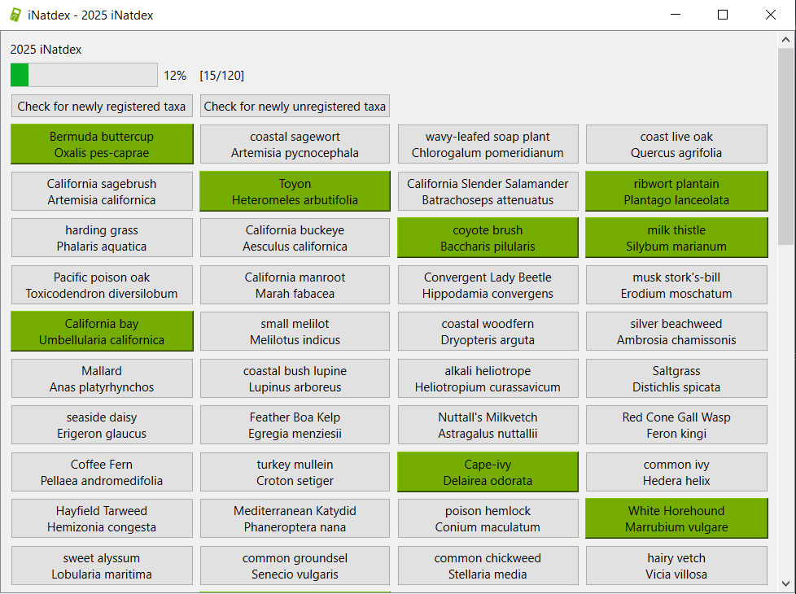

# inatdex
iNatdex is a real-life Pokédex using iNaturalist. It is meant for visualizing your progress on observing target taxa during a time period. Setting it up is a bit janky and the gui is a bit rough, but it isn't slow anymore! (At least in some cases. See instructions for details.)
<br>

<br>
inatdex requires ijson, pyinaturalist, and pyqt6 to run. Install these with:
```
pip install ijson
pip install pyinaturalist
pip install pyqt6
```
<br>
With these installed, you should be able to start iNatdex by running main.py. Further details on using inatdex can be found in instructions.pdf
